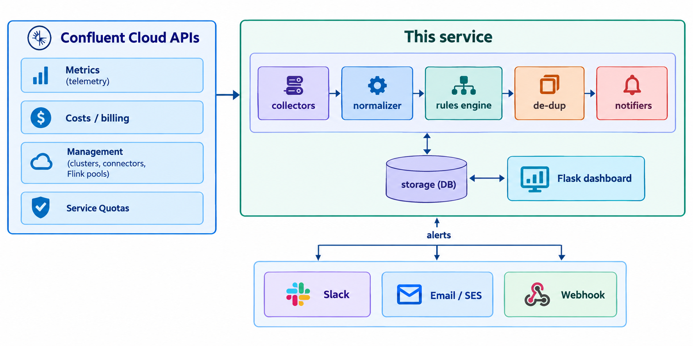

# Confluent Cloud Resource & Billing Alerting


A lightweight, self-hostable alerting service for **Confluent Cloud**. It polls
Confluent's Metrics, Costs, management, and Service Quotas APIs, evaluates
**configurable cost and resource thresholds**, and sends actionable alerts to
**Slack, email, or a webhook** — with a small web dashboard for the last 12
months of spend and current resource health.

> **Status:** proof of concept. It reads your Confluent Cloud account and sends
> alerts; it does not change any Confluent resources. All cost figures are
> *accrued estimates*, not final invoice values (see [Caveats](#caveats)).

## Objectives

Confluent Cloud's built-in notifications cover account, billing, licensing, and
service events — but they don't let you alert on **your own** cost and usage
thresholds. This project fills that gap. Its goals:

- **Configurable cost alerts** — month-to-date budget thresholds (50/80/100%),
  projected month-end overage, and a daily-spend spike check.
- **Configurable resource alerts** — quota utilization (50/90/100%), failed
  connectors, high/idle Kafka clusters, and idle Flink compute pools.
- **Multi-product cost visibility** — spend broken down by product (Kafka,
  Connect, Flink, Tableflow, ksqlDB, …) and by resource.
- **Actionable delivery** — Slack, email (SMTP, incl. Amazon SES), or generic
  webhook, with de-duplication so you aren't spammed.
- **A clear dashboard** — last-12-months spend trend, budget usage, and
  cluster / connector / Flink health.
- **Easy to run** — one Cloud API key, SQLite by default (Postgres optional),
  Docker-friendly.

## How it works



A **scheduler** runs each polling cycle (collect → evaluate rules → de-dup →
notify) and writes a snapshot to the database. A read-only **dashboard** renders
that snapshot plus the spend trend.

## Prerequisites

- **Python 3.12+** (or Docker)
- A **Confluent Cloud API key** on a **service account** with the roles below
- Optional: Postgres (SQLite is used by default), and a Slack webhook / SMTP
  server for delivery

### Required Confluent Cloud access

One **Cloud API key** (scope: *Cloud resource management* — **not** a
Kafka-cluster key) covers everything. Grant its service account:

| Role | Needed for |
|---|---|
| `MetricsViewer` | Metrics API + Service Quotas |
| `BillingAdmin` (or `OrganizationAdmin`) | Costs API |
| read access to environments / clusters / connectors / Flink pools | resource inventory (covered by `OrganizationAdmin`) |

Simplest working setup: **`OrganizationAdmin` + `MetricsViewer`** on one service
account. (Grant `MetricsViewer` explicitly even with `OrganizationAdmin` — the
Metrics API authorizes specifically off that role.)

## Quick start

```bash
# 1. Clone
git clone <your-repo-url> confluent-billing-alerts
cd confluent-billing-alerts

# 2. Install
python3 -m venv .venv
source .venv/bin/activate          # Windows: .venv\Scripts\activate
pip install -r requirements.txt

# 3. Configure credentials
cp config/secrets.env.example config/secrets.env
#   edit config/secrets.env — at minimum set:
#     CONFLUENT_CLOUD_API_KEY / CONFLUENT_CLOUD_API_SECRET
#     CONFLUENT_ORG_ID
#     MONTHLY_BUDGET_USD        (e.g. 1000)

# 4. (Optional) choose which environments and tune thresholds
#   edit config/config.yaml  (leave environment_ids empty to watch all)

# 5. Dry run — collects + evaluates, logs alerts but sends nothing.
#    Safe to run against production.
python -m scheduler.main --once --dry-run

# 6. View the dashboard
python -m dashboard.sync           # pre-populate the DB (snapshot + 12-month trend)
python -m dashboard.app            # open http://localhost:5000
```

## Configuration

**`config/secrets.env`** (never commit this file — it's gitignored):

| Variable | Purpose |
|---|---|
| `CONFLUENT_CLOUD_API_KEY` / `_SECRET` | the one Cloud API key (see roles above) |
| `CONFLUENT_ORG_ID` | your organization id |
| `MONTHLY_BUDGET_USD` | budget for the billing threshold + forecast alerts (e.g. `1000`) |
| `SLACK_WEBHOOK_URL` | Slack Incoming Webhook (optional) |
| `SMTP_HOST` / `SMTP_PORT` / `SMTP_USERNAME` / `SMTP_PASSWORD` / `ALERT_EMAIL_FROM` / `ALERT_EMAIL_TO` | email delivery, incl. Amazon SES (optional) |
| `GENERIC_WEBHOOK_URL` | any webhook receiver (optional) |
| `DATABASE_URL` | Postgres URL; leave blank to use a local SQLite file |
| `DASHBOARD_DB_ONLY` | `1` = dashboard never calls Confluent, only reads the DB |
| `CONFLUENT_METRICS_API_KEY` / `_SECRET` | optional separate least-privilege metrics key; if blank, the Cloud key is used |

**`config/config.yaml`** — which environments to watch, poll intervals, budget
thresholds, quota thresholds, resource-health limits, de-dup cooldowns, and
which notifiers are enabled.

## Running the alerting service

```bash
python -m scheduler.main --once --dry-run   # single cycle, log only (no sends)
python -m scheduler.main --once             # single cycle, send alerts
python -m scheduler.main                    # run continuously on config intervals
```

Enable the notifiers you want in `config/config.yaml` (`notifiers.slack.enabled`,
`notifiers.email.enabled`, `notifiers.generic_webhook.enabled`). To verify email
without waiting for a real alert:

```bash
python -m notifiers.send_test_email         # sends one test alert via your SMTP settings
```

For production, run `scheduler.main --once` on a schedule (e.g. a Kubernetes
CronJob or Cloud Run Job), or run the long-lived loop under a process manager.

## Running the dashboard

```bash
python -m dashboard.app                     # http://localhost:5000
```

- Shows month-to-date accrued spend, budget usage, projected month-end, 24h
  alert counts, a **last-12-months** spend-trend line, spend by product and by
  resource, quota utilization, recent alerts, and cluster / connector / Flink
  health.
- The trend's first load fetches up to 12 monthly totals (one Costs API call per
  month, then cached); the 30-second auto-refresh only re-reads the database, so
  it makes no further Costs API calls.
- Run `python -m dashboard.sync` (or the scheduler) first to pre-populate the DB
  so the first open is instant. Set `DASHBOARD_DB_ONLY=1` to make the dashboard
  read only the database and never call Confluent on its own.

## Run with Docker

```bash
cp config/secrets.env.example config/secrets.env   # fill it in
docker compose up -d                                # Postgres + scheduler + dashboard
# dashboard on http://localhost:5000
```

## What it alerts on

Rules are declarative in [`rules_engine/rules.yaml`](rules_engine/rules.yaml) and
easy to edit:

- `monthly_budget_threshold` — MTD accrued spend at 50 / 80 / 100% of budget
- `forecast_month_end_over_budget` — projected month-end spend over budget
- `daily_spend_spike` — a day's spend well above the trailing average
- `quota_utilization` — service quota at 50 / 90 / 100%
- `connector_failed` — a connector in a FAILED state
- `cluster_utilization_high` / `cluster_idle_with_cost` — busy or idle Kafka clusters
- `flink_pool_idle` — a provisioned Flink compute pool using 0 CFUs
- `resource_deleted_unexpectedly` — a resource disappeared between polls
  *(ships as an example but is inert until a collector emits its metric — see
  "Add a brand-new metric" below)*

## Customizing alert rules

The rules above are **just a starting set** — they live entirely in
[`rules_engine/rules.yaml`](rules_engine/rules.yaml) and are meant to be edited
for your own thresholds and use cases. No code change is needed to add, remove,
retune, or re-word a rule, as long as it uses a metric the service already
produces (listed below). Changes take effect on the next scheduler cycle
(restart the loop, or re-run `python -m scheduler.main --once`).

### Anatomy of a rule

```yaml
rules:
  - name: monthly_budget_threshold        # unique id; also the de-dup key prefix
    category: billing                      # free-form label shown on the alert
    scope: organization                    # organization | per_quota | per_resource
    metric: mtd_spend_pct_of_budget        # which fact to evaluate (see table below)
    severity_thresholds:                   # fire at the HIGHEST threshold the value >= 
      - {value: 50,  severity: INFO}
      - {value: 80,  severity: WARNING}
      - {value: 100, severity: CRITICAL}
    message_template: >-                    # Python str.format template (placeholders below)
      Month-to-date accrued spend is {current_value:.1f}% of the
      ${budget_usd:,.0f} monthly budget (${mtd_spend_usd:,.2f} so far).
    cooldown_minutes: 360                   # suppress repeats of this rule+resource for N minutes
```

### Field reference

| Field | Meaning |
|---|---|
| `name` | Unique rule id. Combined with the resource id to form the de-dup key, so each rule/resource pair has its own cooldown. |
| `category` | Free-text label shown on the alert (e.g. `billing`, `resource_utilization`). Group rules however you like. |
| `scope` | `organization` (one org-wide value), `per_quota` (evaluated for each quota), or `per_resource` (evaluated for each cluster / connector / Flink pool). |
| `metric` | The fact key to compare against the thresholds. Must be one the service produces for that scope (see next table). Not a raw Confluent metric name. |
| `severity_thresholds` | A list of `{value, severity}`. The rule fires at the **highest** threshold whose `value` the metric **meets or exceeds** (`>=`). Below the lowest threshold, nothing fires. |
| `message_template` | The alert text. A `str.format` template — use `{placeholder}` and format specs like `{current_value:.1f}` or `${budget_usd:,.2f}`. |
| `cooldown_minutes` | How long to suppress repeats of the same rule + resource (default 60 if omitted). A worsening severity (e.g. WARNING→CRITICAL) breaks through the cooldown. |

### Metrics you can use (produced today)

Pick a `metric` that matches your `scope`:

| scope | metric | meaning |
|---|---|---|
| `organization` | `mtd_spend_pct_of_budget` | month-to-date accrued spend as % of budget |
| `organization` | `mtd_spend_usd` | month-to-date accrued spend (USD) |
| `organization` | `forecast_pct_of_budget` | projected month-end spend as % of budget |
| `organization` | `forecast_usd` | projected month-end spend (USD) |
| `organization` | `daily_spend_ratio_to_trailing_avg` | yesterday's spend ÷ trailing-7-day average |
| `per_quota` | `quota_utilization_pct` | a service quota's usage as % of its applied limit |
| `per_resource` | `connector_failed` | `1` if a connector is FAILED, else `0` |
| `per_resource` | `cluster_utilization_pct` | Kafka cluster load % *(requires the Metrics API; skipped if that metric isn't exposed for the cluster type)* |
| `per_resource` | `idle_with_nonzero_cost` | `1` if a cluster had ~zero throughput but incurred cost *(requires the Metrics API)* |
| `per_resource` | `flink_pool_idle` | `1` if a Flink pool is provisioned but using 0 CFUs |

The matching context values are also available as `message_template`
placeholders — e.g. an `organization` rule can use `{budget_usd}`,
`{yesterday_spend_usd}`, `{trailing_avg_usd}`; any rule can use
`{current_value}`, and `per_quota`/`per_resource` rules can use `{resource_id}`
and `{environment_id}`.

> **Severity names matter for escalation:** use `INFO`, `WARNING`, `CRITICAL`.
> The de-dup logic lets a higher severity break through an active cooldown, so
> a situation that worsens still alerts.

### Common customizations

- **Change a budget threshold:** edit the `value`s under
  `monthly_budget_threshold` (and set your budget via `MONTHLY_BUDGET_USD`).
- **Make an alert less noisy:** raise its `cooldown_minutes`.
- **Change a cluster-utilization trigger:** edit the `value` under
  `cluster_utilization_high` (e.g. `70` instead of `80`).
- **Disable a rule:** delete it, or comment out its block in `rules.yaml`.
- **Add a rule that reuses an existing metric:** copy a block, give it a new
  `name`, and change the thresholds/message. Example — warn at 90% of budget
  only:

  ```yaml
  - name: budget_90_warning
    category: billing
    scope: organization
    metric: mtd_spend_pct_of_budget
    severity_thresholds:
      - {value: 90, severity: WARNING}
    message_template: "Heads up: {current_value:.0f}% of the monthly budget used."
    cooldown_minutes: 360
  ```

### Add a brand-new metric (needs a small code change)

If you want to alert on something not in the table above, the rule needs a fact
to evaluate. Produce it where the per-cycle facts are assembled in
`scheduler/main.py` (`gather_facts`), adding your value under the right bucket
(`facts["organization"][...]`, `facts["per_quota"][...]`, or
`facts["per_resource"][resource_id][...]`), typically from a new or existing
collector in `collectors/`. Then reference that key as the rule's `metric`.
This is also what the inert `resource_deleted_unexpectedly` example needs — a
collector that emits a `resource_disappeared` fact.

### Test your changes

```bash
pytest tests/test_rules_engine.py          # unit-tests rule evaluation (no credentials needed)
python -m scheduler.main --once --dry-run  # runs your rules against the live account, logs only
```

`--dry-run` prints exactly which alerts would fire without sending anything, so
it's the fastest way to confirm a new threshold behaves as intended.

## Project structure

```
collectors/     Confluent Cloud API client + per-source collectors
normalizer/      Shapes raw API output into storage rows
rules_engine/    rules.yaml + the threshold evaluator
dedup/           Cooldown-based alert de-duplication
notifiers/       Slack / email (SMTP/SES) / webhook senders (+ send_test_email)
storage/         SQLAlchemy models, DB session, persistence
scheduler/       Orchestration entrypoint (one cycle or a loop)
dashboard/       Flask app, read queries, cost-history cache, sync/diagnose CLIs
config/          config.yaml + secrets.env.example
docs/            design.md, api-notes.md, pain-points.md
tests/           pytest unit tests
```

## Caveats

- **Accrued, not invoiced.** Confluent billing accrues hourly and Costs API data
  can lag up to ~72 hours; marketplace data can lag further. Every figure here is
  an accrued estimate — reconcile against your invoice, not this tool.
- **Complements, doesn't replace** Confluent Cloud's built-in notifications.
- **POC quality.** Endpoint paths, metric names, and response shapes were
  verified against Confluent docs at build time but can change; see
  [`docs/api-notes.md`](docs/api-notes.md) for specifics and
  [`docs/pain-points.md`](docs/pain-points.md) for known API friction. Verify
  against your own org before relying on it.

## Contributing

Contributions welcome — see [`CONTRIBUTING.md`](CONTRIBUTING.md). In short:
tests run without Confluent credentials (mocked), never commit secrets, and
don't hardcode unverified Confluent API details.

